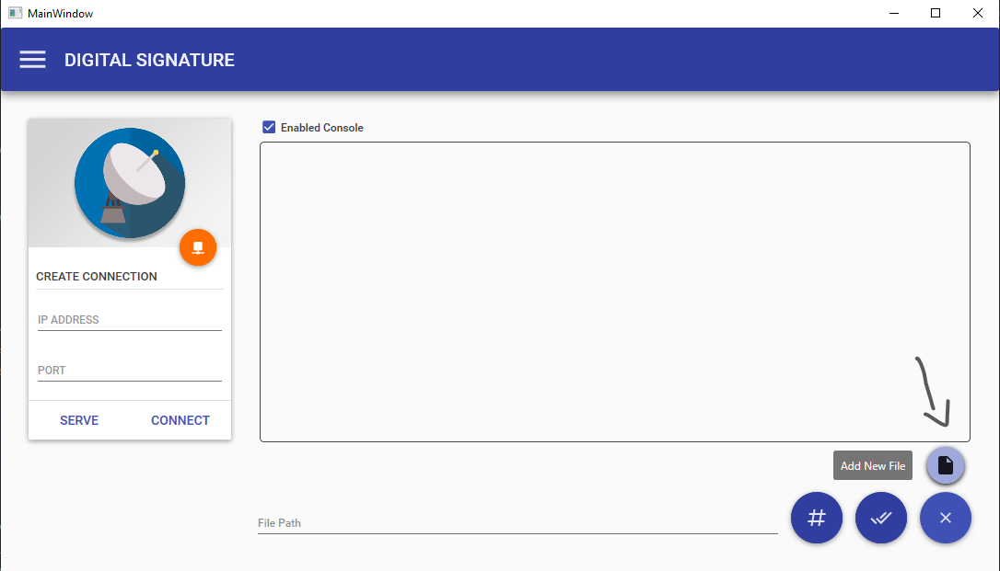
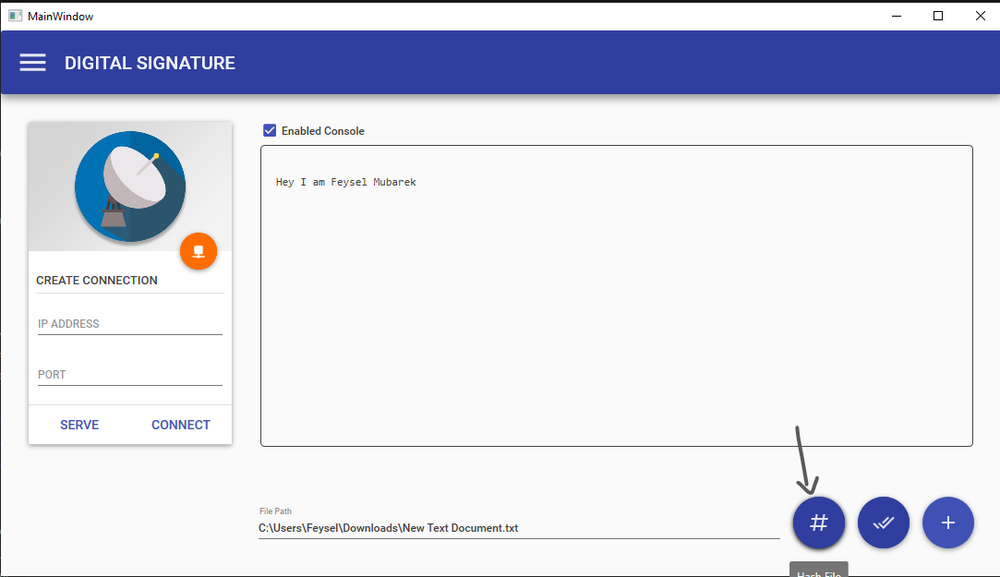
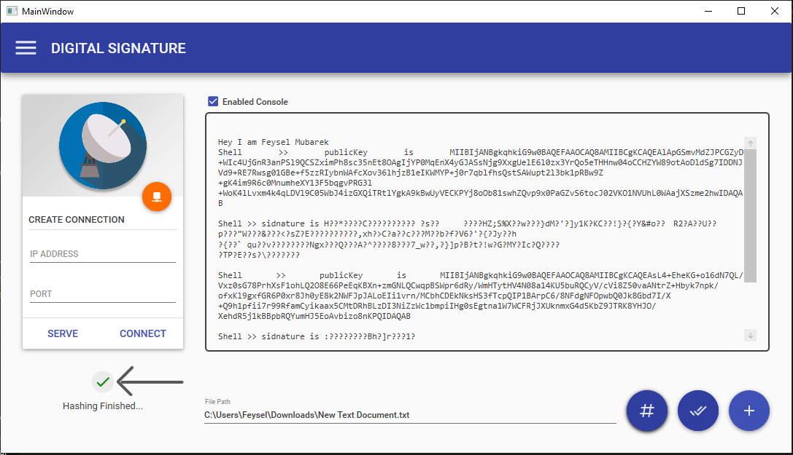
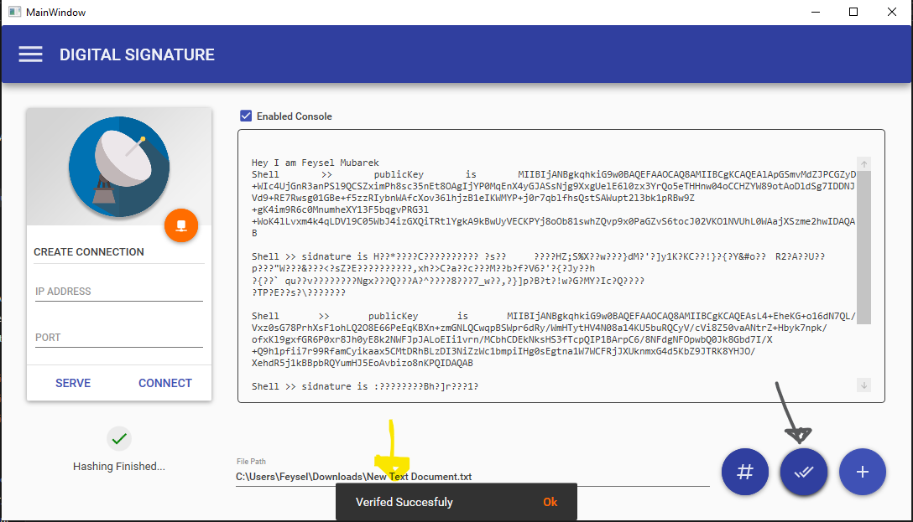

# digitalSignature

Use the build exe file found in debug folder
link => https://github.com/feyselmubarek/digitalSignature/blob/master/Digital%20Signature/bin/Debug/

<h3>Steps for Checking</h3>

## 1. Add File

## 2. Hash File

## 3. Check Hashing to be finished

## 4. Verify the signature

